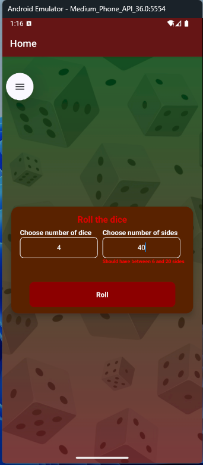
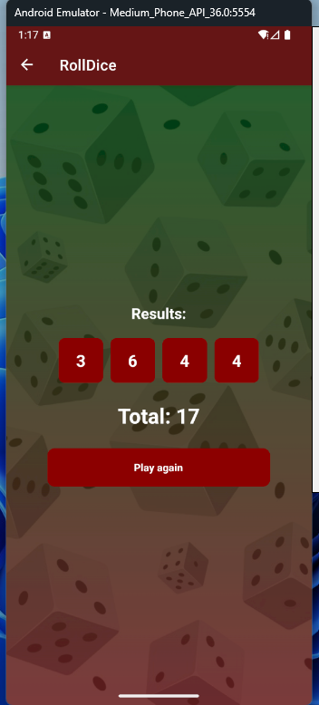
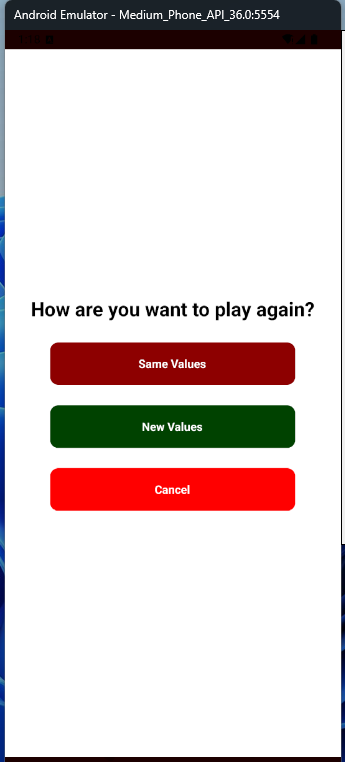
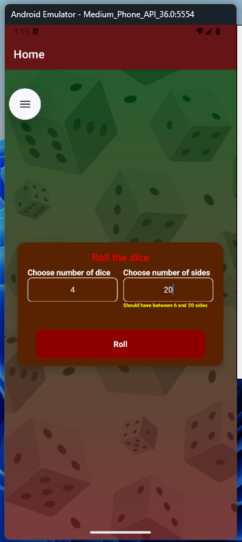
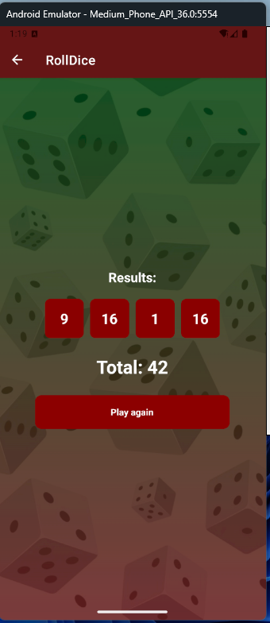
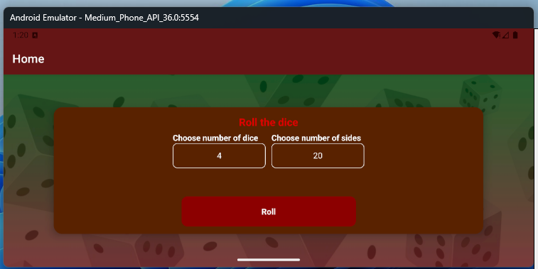
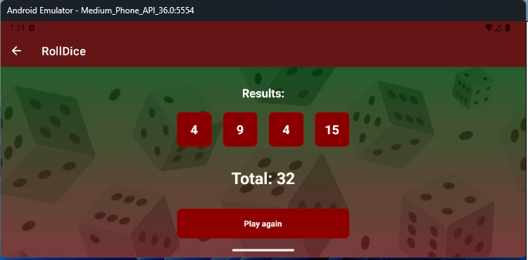
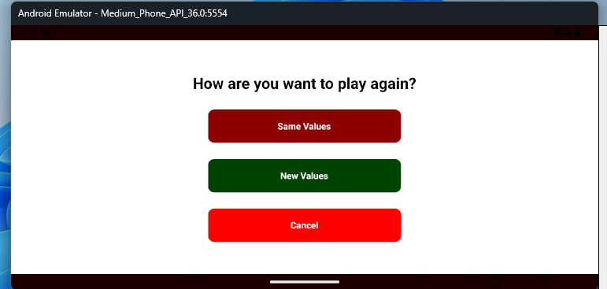

# Roll the dice

## About the project
This is a simple app to roll 1 to 4 dice with 6 to 20 sides.

## How to install the project dependencies

To run this app, you need to install the dependencies with ```npm i``` or ```npm install```. 


## How can I run this project?
 After running the command above, execute ```npx expo start``` or ```npm start``` and select your preferred mobile device.

 ## Technologies used
 - Redux
 - React Mavigation
 - Hooks
 - Flexbox
 - Responsivity

 # Below images and text about the project

## Start screen


### When the input is focused, it sends an alert about the correct values to be entered.


### If you enter an invalid value, the default value will be considered.


### result if the value is entered incorrectly and the default value is considered.


### When the Play Again button is clicked, a modal opens with the following options: 
- ### Same Values:
 Rolls the dice again with the values previously entered.
- ### New Values:
 Returns to the home screen to enter new values.
- ### Cancel: 
Closes the modal and returns to the screen with the previous result.



### Initial screen with valid values



### Result with valid values



### The images below follow the normal flow but with the phone horizontal.





